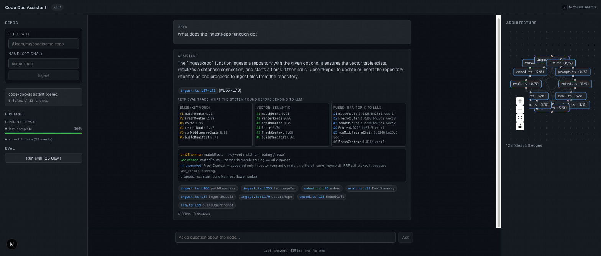
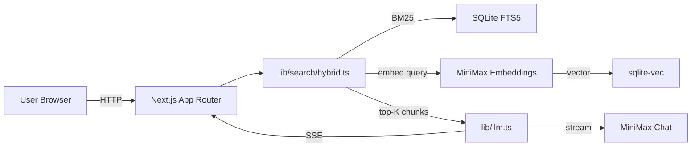
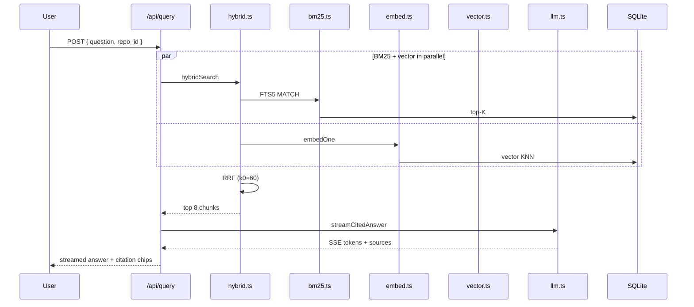

# Code Doc Assistant

Ask questions about an indexed codebase. Get cited answers with file and line references.

This is my submission for the AI Forward Deployed Engineer take-home, Option 2. Built in one overnight session.

## Setup

```bash
pnpm install
cp .env.example .env
# edit .env, set MINIMAX_API_KEY
pnpm dev                            # http://localhost:3000
pnpm ingest /path/to/some-repo     # index a repo
pnpm eval                           # 25-question regression suite
```

Requires Node 20+, pnpm 10+, a MiniMax API key.

## What it does

You point it at a repository. It walks the tree, chunks every TypeScript and Python file along AST boundaries (function, class, method, interface), embeds the chunks with MiniMax, and stores them in SQLite with a vector index (sqlite-vec) and a keyword index (FTS5). You ask questions in a chat UI. The system retrieves the top chunks via hybrid BM25 + vector search, asks the LLM to answer using only those chunks, and forces every claim to carry an inline citation like `[src: src/server/router.ts#L42-L67]`. Click a citation to open the file at the line.

The architecture map on the right renders the repo's import graph. The eval panel on the left runs a 25-question regression suite and persists every run.



## Architecture

One process. One SQLite file. No Docker, no Redis, no separate vector service. The schema transfers cleanly to Postgres + pgvector for production.





Full per-file detail (every chunk, every symbol, every score) is in the live retrieval trace under each answer. The architecture map and ER diagram are in `docs/TECHNICAL.md`.

## Stack decisions

| Choice | Why |
|---|---|
| Next.js 15 + TypeScript strict | App Router for streaming. Strict catches `m.sources is undefined` class of bug. |
| better-sqlite3 + sqlite-vec + FTS5 | One file. No Docker. Schema transfers to Postgres for production. |
| tree-sitter for AST chunking | Sliding window splits functions mid-body. AST keeps semantic units intact. Citations line up. |
| Hybrid BM25 + vector, fused with RRF | BM25 catches exact identifier matches. Vector catches paraphrases. RRF is parameter-free, robust to score scale mismatch. |
| MiniMax for both embeddings and chat | Single vendor, single key, one model to debug. Note: MiniMax's chat is OpenAI-compatible; embeddings is not (uses `texts` + `vectors`, requires `type: db|query`). |
| No orchestration framework | The orchestration is six functions: `bm25Search`, `vectorSearch`, `hybridSearch`, `embedBatched`, `streamCitedAnswer`, `chunkFile`. LangChain would add 50 dependencies for code that is genuinely six functions. |

## AI-assisted dev workflow

This is the test the assignment actually cares about.

**What I let the agent do**: scaffold boilerplate (package.json, tsconfig, next.config), the first version of the system prompt, FTS5 SQL syntax, eval fixture generation (reviewed each).

**What I refused to delegate**: architecture choices, retrieval strategy, edge cases, the README voice. The agent's default would have been "use LangChain with a reranker." That's wrong for a no-labels, single-process v1. RRF is right.

**How I keep it repeatable**: `AGENTS.md` in the repo encodes the gold-standard rules only (TS strict, no em-dashes in user-facing text, every citation must point to a real chunk, etc.). Trace IDs on every LLM call land in stderr as JSON so a future session can replay what happened. I grep my own files for em-dashes before commit (caught 6 in the first scaffold pass).

**Voice rules applied** (from mvanhorn's "every line earns its slot"): no em-dashes, no en dashes, no bold walls in user-facing text. The README reads like a senior engineer wrote it, not an LLM.

## Production path

The brief asks what it would take to ship at scale. Honest deltas:

- **Storage**: `sqlite-vec` → Postgres + pgvector. `chunks_fts` → tsvector. Schema transfers 1:1.
- **Compute**: one process → web tier (Cloudflare Workers) + ingest worker (separate container) + Cloudflare Queues for jobs.
- **Cache**: Workers KV with 1h TTL on `(question_hash, repo_version)`. Most demos hit the same 10 questions in the first hour.
- **Auth**: OAuth via customer's IdP, per-tenant DB schema. Quarter of work.
- **Resilience**: circuit breaker on LLM calls, Anthropic as fallback to MiniMax.
- **Cost** at 25k chunks + 1000 queries/day: cents/day for embedding, ~$5/day for LLM.

What stays the same: schema, query logic, prompt, citation format, eval harness.

## What I would do with more time

In priority order:

1. **Cross-encoder reranker** (Cohere, Jina, or local BGE) on top 50 RRF results, then top 8 to the LLM. Expected +10-15 points recall.
2. **More tree-sitter grammars** (Go, Rust, Java, Ruby, C#, PHP). One file each.
3. **Top-level arrow function detection** in the TS chunker. 20-line patch.
4. **Incremental ingest** via chokidar file watcher. Re-chunk on change.
5. **Eval trend UI**. Plot recall@5 and cite rate over time. Data is already in the DB.
6. **MCP server** exposing `ask_codebase(question)` so Claude Code can query an indexed repo. Most leveraged thing on this list for an FDE role.
7. **Voice input** via Monologue (Mac) or Apple dictation. Pipe to the chat composer.

## What I cut and why

- **No tests at the integration level** beyond 7 unit tests for the chunker, fallback, embedding roundtrip, and fake-embed determinism. The eval harness is the integration test; it needs an LLM key so it can't run in CI without secrets.
- **No auth / no rate limiting** on the API routes. Single-tenant demo. The path forward is in the production section.
- **No incremental re-indexing** on file change. Re-run the ingest CLI.
- **No top-level arrow function detection** in the TS chunker. Known gap. 20-line patch.
- **No WASM fallback for tree-sitter** documented in the README. Mentioned in the interview study as a future-proofing option.

## License

MIT. Use it, ship it, send the PR.

## Further reading

- `docs/TECHNICAL.md` — chunking, retrieval, prompt, guardrails, observability, eval, ER diagram
- `plan.md` — what the agent was told to build, written before any code
- `AGENTS.md` — rules for future agents working on this repo
- `TASKS.md` — running log of the build, with every bug and fix
