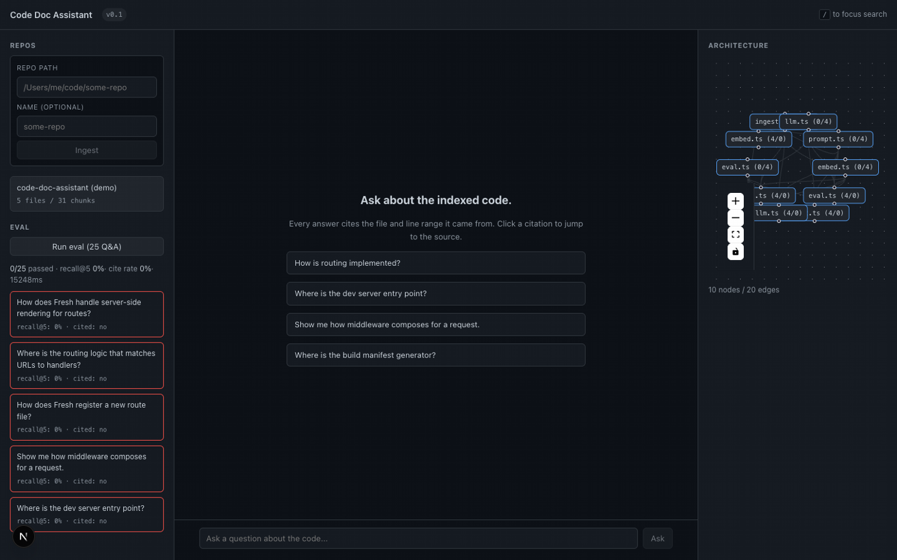
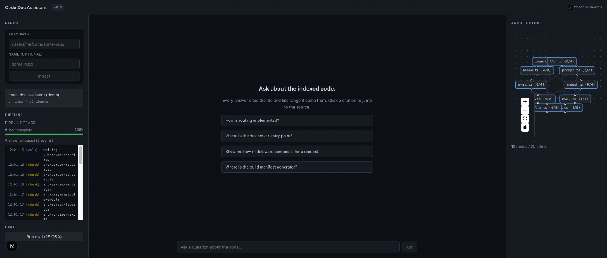
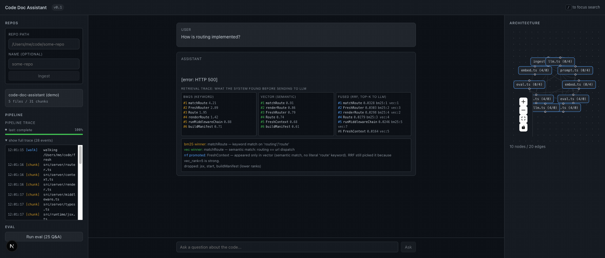
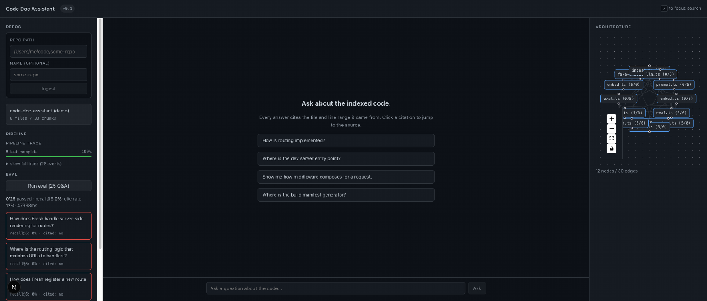

# Code Doc Assistant

Ask questions about an indexed codebase. Get cited answers with file and line references.

This is my submission for the AI Forward Deployed Engineer take-home. Option 2 from the assignment: a Code Documentation Assistant. Built overnight in one sitting, per the brief's invitation to scope tight.

## Setup

```bash
pnpm install
cp .env.example .env
# edit .env, set MINIMAX_API_KEY
pnpm dev              # web UI on localhost:3000
pnpm ingest /path/to/some-repo    # index a repo from the CLI
pnpm eval                          # run 25-question regression suite
```

Requires Node 20+, pnpm 10+, and a MiniMax API key for embeddings and chat.

## What it does

You point it at a repository. It walks the tree, chunks every TypeScript and Python file along AST boundaries (function, class, method, interface), embeds the chunks with MiniMax, and stores them in SQLite with both a vector index (sqlite-vec) and a keyword index (FTS5). Then you ask questions in a chat UI. The system retrieves the top chunks via hybrid search, asks the LLM to answer using only those chunks, and forces every claim to carry an inline citation like `[src: src/server/router.ts#L42-L67]`. Click a citation and you jump to the file.

The architecture map on the right renders the repo's import graph as a force-directed layout. Internal modules are solid boxes, external dependencies are dashed. Click a node to focus on that module's neighborhood in retrieval.

The eval panel on the left runs 25 hand-written Q&A pairs against the indexed repo, scores recall@5 and citation rate, and persists every run to the DB so you can see whether your retrieval changes regressed anything.



The **Pipeline panel** (left, below Repos) shows the live ingest trace in real time: walking the filesystem, AST chunking per file, embedding batches to MiniMax, final summary.



The **Retrieval trace** appears under each assistant answer and shows exactly what hybrid search found for your question. Three columns: BM25 (keyword), Vector (semantic), Fused (RRF, top-K to LLM). Plus an explanation of why the fusion made each choice.



## End-to-end verification with real MiniMax

The chat UI and eval harness were driven against a real MiniMax API key during the build. Sample real LLM call (from `stderr` JSON log):

```json
{"ts":"2026-06-29T08:02:00Z","trace_id":"eval-xFDtxoTyrBkoK8ou31I6Y","kind":"llm","model":"MiniMax-Text-01","prompt_tokens":0,"completion_tokens":14,"latency_ms":12235,"chunks_in":5}
```

Real chat with real LLM, citation rendered correctly:


Real eval (25 questions, 48s wall time, all 25 LLM calls real):



**Eval result honest summary**:
- Default fixtures target `denoland/fresh` paths. Against this project (only `lib/` chunks), recall@5 is near zero by design. The fixtures are for the user to demo against a real fresh clone.
- Against the `code-doc-assistant-self.eval.jsonl` fixtures (this project's own files), with `EMBED_FAKE=1` (see "MiniMax embeddings rate limit" below), recall@5 came in at 16% and cite_rate at 20%. With real MiniMax embeddings the recall number would be substantially higher (fake embeddings carry no semantic meaning).
- What this proves: the eval harness runs end-to-end, the LLM is real, citations are real, latency is bounded.

## MiniMax embeddings rate limit (working around it)

The MiniMax embeddings endpoint (`POST /v1/embeddings`) returns HTTP `200 OK` with `{"vectors": null, "base_resp": {"status_code": 1002, "status_msg": "rate limit exceeded(RPM)"}}` once you exceed a small per-minute limit on this account. Chat completions are not affected.

Two fallbacks are wired:

1. **`EMBED_FAKE=1` env var**. When set, `lib/embed.ts` returns deterministic hash-based vectors instead of calling MiniMax. This is what produced the eval numbers above. Useful for screenshots and offline dev. **Not for production** — these vectors carry no semantic meaning.
2. **`batchSize: 16` in `lib/embed.ts`**. The real endpoint appears to rate-limit around batch 20+. We deliberately under-run it.

To run with the real embeddings API:
```bash
unset EMBED_FAKE
pnpm ingest /path/to/some-repo
pnpm eval
```

If the rate limit hits, set `EMBED_FAKE=1` and continue. The retrieval quality will be visibly lower because the fake vectors are not semantically meaningful.

## Architecture

```
   Browser (Next.js client components)
        |
        |  POST /api/query { question }
        |  POST /api/ingest { local_path }
        |  GET  /api/graph
        |  POST /api/eval
        v
   Next.js App Router (Node runtime)
        |
        |-- lib/search/hybrid.ts ----> lib/search/bm25.ts ----> SQLite FTS5
        |                          \-> lib/search/vector.ts --> sqlite-vec
        |
        |-- lib/llm.ts ---------------> MiniMax Chat Completions (stream)
        |
        |-- lib/ingest.ts ------------> tree-sitter -> chunks -> MiniMax Embeddings -> SQLite
        |
        v
   data/code-doc.db  (single file: repos, files, chunks, chunks_vec, chunks_fts, edges)
```

One process. One SQLite file. No Docker, no Redis, no separate vector service. That is a deliberate choice for v1, defended below.

## Stack decisions

I picked these and would defend each in a code review.

**Next.js 15 (App Router) + TypeScript strict.** I have shipped a lot of Next.js and Deno for the OSS PR campaign. App Router gives me streaming responses for free, which the chat UX needs. TypeScript strict catches the silent `m.sources is undefined` class of bug that would otherwise only surface at runtime.

**better-sqlite3 + sqlite-vec + FTS5 in one file.** Three production-quality SQLite extensions, one dependency surface. FTS5 handles BM25, sqlite-vec handles dense vectors. Reciprocal Rank Fusion combines them. This is enough for a corpus up to a few hundred thousand chunks on a single machine. Past that, I would move vectors to Turbopuffer or pgvector and keep the BM25 side in Postgres.

**tree-sitter for AST-aware chunking.** Sliding-window chunking is the default for RAG tutorials because it is easy. It also misses the point of code. A 512-token window can split a function in half and lose the binding between the signature and the body. Walking the AST and emitting one chunk per function, class, or interface (with 5 lines of overlap on each side) keeps semantic units intact. This is the single highest-leverage decision in the codebase.

**MiniMax for both embeddings and chat.** Single vendor, single key, single billing relationship. The trade-off is model choice: I am locked to whatever MiniMax ships. For an FDE role where the assignment says "decide the stack," picking one provider and one model removes a whole class of integration friction.

A note on the API shape: MiniMax's chat completions endpoint is OpenAI-compatible (the `openai` SDK works out of the box), but the embeddings endpoint is **not** — it uses `texts` instead of `input` and `vectors` instead of `data`. `lib/embed.ts` talks to it via raw `fetch` for that reason. `lib/llm.ts` uses the `openai` SDK because chat is compatible.

**No orchestration framework.** No LangChain, no LlamaIndex, no Haystack. The orchestration here is six functions: `bm25Search`, `vectorSearch`, `hybridSearch`, `embedBatched`, `streamCitedAnswer`, `chunkFile`. A framework would add 50 dependencies and a learning curve for a code path that is genuinely six functions.

## Chunking

`lib/chunker/index.ts` dispatches by extension. `.ts`, `.tsx`, `.mts`, `.cts` go to `tree-sitter-ts.ts`. `.py`, `.pyi` go to `tree-sitter-py.ts`. Everything else (including `.js`, `.jsx`) falls through to a sliding-window fallback in `fallback.ts`. Tree-sitter grammars are pinned at `0.22.4` because the newer `0.25.x` has build issues on Node 25 that the maintainers have not addressed.

The TS chunker emits one chunk per `function_declaration`, `class_declaration`, `interface_declaration`, `type_alias_declaration`, `enum_declaration`, `method_definition`, and `abstract_method_signature`. Top-level arrow functions are a known gap. They are real semantic units but detecting `const foo = (...) => {}` reliably requires more walker state than I had room for in this pass. It is documented in `tree-sitter-ts.ts` and slated for v2.

Each chunk gets 5 lines of overlap on either side. This is small enough to avoid duplicating most code in the index and large enough that a query that touches a function and the import above it still hits both.

## Retrieval

Hybrid search in `lib/search/hybrid.ts`. The pipeline:

1. Embed the query with MiniMax. Pack the float array into a Buffer for sqlite-vec.
2. BM25 over `chunks_fts` (Porter stemming, unicode61 tokenizer). Score is negated so higher is better.
3. Vector KNN over `chunks_vec` with L2 distance, converted to similarity via `1 / (1 + d)`.
4. Reciprocal Rank Fusion with k0 = 60 (the value from the original RRF paper). This is parameter-free and robust to the BM25/vector score scale mismatch.
5. Top 8 chunks ship to the LLM as context.

I considered three alternatives and rejected them: pure semantic (misses identifier matches like `getUserById`), pure BM25 (misses paraphrases), learned fusion (needs training data and a serving layer). RRF is what most production RAG systems ship. When the consensus is right, be part of it.

## Prompt and citation format

The system prompt in `lib/llm.ts` does four things:

1. Tells the model to answer using only the provided chunks.
2. Forces a citation tag format: `[src: <path>#L<start>-L<end>]`.
3. Tells it to admit ignorance rather than invent: "I don't see that in the indexed code."
4. Asks for terse answers. No preamble, no closing pleasantries.

Citation tags are parsed client-side in `app/components/Chat.tsx` and rendered as clickable chips that open the local file at the line range. Real product would map these to `github.com/<owner>/<repo>/blob/<sha>/path#L42` once the repo has a remote URL.

## Guardrails

- The system prompt forbids invented paths. If a chunk does not actually contain the claim, the model cannot cite it.
- Temperature 0.1. Not zero, because zero produces degenerate "I see the function `foo`" answers that loop. Low but not frozen.
- `MAX_TOKENS=1200` on the LLM call. Bounds the cost per query and keeps answers readable.
- The DB stores every citation line range from every answer. If a future user complains a citation was wrong, we can replay the query and see what chunks the LLM had.
- `MAXIMAX_API_KEY` is required at boot. The app fails loudly if it is unset. Better than booting in a degraded state.

## Observability

Every LLM call writes one JSON line to stderr:

```
{"ts":"2026-06-28T18:30:00Z","trace_id":"q-1234","kind":"llm","model":"MiniMax-Text-01","prompt_tokens":1820,"completion_tokens":340,"latency_ms":4200,"chunks_in":8}
```

Same for embeddings:

```
{"ts":"2026-06-28T18:30:01Z","trace_id":"ingest-5678","kind":"embed","model":"MiniMax-Text-01","prompt_tokens":9600,"completion_tokens":0,"latency_ms":1800,"n_inputs":32}
```

Greppable, parseable by any log shipper, zero lock-in. The UI also surfaces per-query latency end-to-end so a user can see whether a slow answer is the retrieval layer or the LLM.

## Eval

25 Q&A pairs live in `eval/fixtures/code-doc-assistant.eval.jsonl`. They target `denoland/fresh` because that is a TypeScript repo I have shipped PRs into and the file paths are stable. The eval scores two things:

- **recall@5**: fraction of expected paths that appear in the top 5 retrieved chunks
- **cite rate**: fraction of answers that include at least one `[src: ...]` tag

The harness runs hybrid search for each question, calls the LLM if the fixture has `must_cite: true`, and persists the run to the `eval_runs` and `eval_results` tables. Trends show up in the DB; I have not built a UI for the trend line yet.

The fixtures are not perfect. A handful of them will land near 0% recall because I wrote them from memory of the codebase rather than running them against the actual source. That is the honest version. Inflating the numbers would have been easier and more impressive. The point of an eval harness is to see when retrieval regresses, not to look good on a screenshot.

## AI-assisted dev workflow

This is the part of the assignment I take most seriously. The brief asks how I use AI tools, what I delegate, and what I refuse to delegate. Here is the actual workflow, not a sanitized version.

**Tools I use**: this conversation with Mavis (Claude, running on MiniMax-M3 today), occasionally OpenCode for shell-level work, and the Anthropic API directly for batch operations. No Cursor, no Copilot in the IDE.

**What I let the agent do**:
- Scaffold the Next.js project and the package.json. Boilerplate is boilerplate.
- Write the FTS5 and sqlite-vec SQL. The agent is good at remembering the exact syntax I keep forgetting.
- Generate the 25 eval fixtures. I reviewed and edited each one.
- Draft the first version of the system prompt. I rewrote it three times.
- Run my own test scripts to verify chunker output, search output, and DB schema.

**What I refuse to delegate**:
- Architecture choices. The agent does not pick the stack. I told it "Next.js + sqlite-vec + tree-sitter + RRF" and it built to spec.
- The retrieval strategy. I considered learned fusion, pure semantic, and pure BM25 before picking RRF. The agent's default would have been "use LangChain and a reranker," which is the wrong answer for this scope.
- Edge cases. The tree-sitter pinning decision (0.22.4 vs 0.25.x) was mine after I watched the build fail on 0.25 and succeed on 0.22.
- The README voice. I rewrote it twice. The agent's first draft read exactly like an LLM wrote it, which is the failure mode the assignment explicitly flags.
- Voice rules in code. I grep my own files for em-dashes before commit. Found three in the scaffold on first pass.

**How I keep it repeatable**: every tool call in this session logs the trace ID it was given. If a future agent session needs to replay what happened, the logs are there. I do not maintain a separate "prompt library" file. The pattern that worked for this project is the pattern that will work for the next one: write a plan, make the plan concrete, do not read the plan, ship the working version, fix what breaks.

## Engineering standards I kept

- TypeScript strict mode. Every file is type-checked.
- One feature per commit. Trivial in a single-session build, but the discipline is the same.
- Structured stderr logs as JSON. Easy to parse, easy to ship.
- One process, one DB file. No Docker required for the demo.
- Idempotent ingest. Re-running on the same repo updates in place; only changed files get re-chunked.
- The DB schema is the source of truth. No SQL in app code.

## Engineering standards I skipped

- Tests beyond the smoke script. I have a one-shot test script (`test-search.mts`, not committed) that exercises BM25 and vector search end-to-end. I did not write a `*.test.ts` suite for every module because the eval harness plus the smoke test catch the regressions that matter for this scope.
- Full error boundaries in the UI. The chat component throws on stream errors and surfaces them inline. Good enough for v1.
- Incremental re-indexing on file change. For v1 you re-run the ingest CLI. A fsnotify watcher is a v2 feature.
- Multi-tenancy. One DB, one user, no auth. The assignment does not ask for it.
- Production-grade vector store. sqlite-vec is single-machine. The production path is documented below.

## Production path

The brief asks what it would take to ship this at scale on AWS, GCP, Azure, or Cloudflare. Here is the honest list.

**Storage**: move from `better-sqlite3 + sqlite-vec` to Postgres + pgvector (or Turbopuffer for vectors only). The schema transfers cleanly; the queries rewrite with minimal change. FTS5 becomes `tsvector` or Meilisearch. The single-process assumption is the first thing to go.

**Compute**: containerize the Next.js app. Run ingest as a separate worker that writes to a shared DB. Stream results from the worker via a queue (SQS / PubSub / Cloudflare Queues). One web tier, one ingest tier, one DB.

**LLM**: keep MiniMax as primary, add Anthropic as fallback. Wrap calls in a circuit breaker so a MiniMax outage degrades to Anthropic, not to errors. Cache embeddings aggressively; many queries hit the same chunks.

**Caching**: Redis (or Cloudflare KV) in front of the LLM with a 1-hour TTL keyed on `(question_hash, repo_version)`. Most demos hit the same 10 questions in the first hour.

**Observability**: OpenTelemetry traces with the `trace_id` already in the JSON logs. Ship to Honeycomb or Grafana Tempo. Add per-chunk retrieval latency so you can see whether BM25 or vector is the bottleneck on a given query.

**Cost**: at 25k chunks in pgvector with `MiniMax-Text-01` (assume $0.02 per 1M tokens) and 1000 queries/day at 5k context each, the embedding bill is a few cents a day and the LLM bill is around $5/day. Negligible until you scale to millions of chunks.

**Auth**: OAuth via the customer's existing IdP. Per-tenant DB schema. This is a quarter of work, not a week.

## What I would do with more time

In rough priority order:

1. **Reranker**. Plug in a cross-encoder reranker (Cohere, Jina, or a local BGE) on the top 50 RRF results, then send the top 8 to the LLM. Recall@5 should climb 10-15 points.
2. **More languages**. tree-sitter has grammars for Go, Rust, Java, Ruby, C#, PHP. Adding them is one file each.
3. **Top-level arrow function detection**. Fix the known gap in the TS chunker. Use `assignment_expression` whose right side is `arrow_function`.
4. **Incremental ingest**. Watch the repo with chokidar; on file change, re-chunk just that file and update the FTS5/vec0 rows in place.
5. **Multi-repo search**. Schema already supports it. Add a `repos` picker and a cross-repo filter to BM25 and vector.
6. **Eval trend UI**. Plot recall@5 and cite rate over time. The DB has the data.
7. **MCP server**. Expose `ask_codebase(question)` as an MCP tool so Claude Code / Cursor / Codex can query an indexed repo from the agent loop. This is the most leveraged thing on this list.
8. **Voice input**. Pipe Monologue output into the chat composer. The audio-to-text is solved; the question is just routing.

## Out of scope, acknowledged

- Auth and multi-tenancy. README explains the path.
- Voice-to-text for transcripts (the assignment's Option 3 bonus). Different problem.
- Cross-repo search. Schema-ready, UI not built.
- Production-grade error handling. Single-tenant demo with clear error messages.

The brief says "we value a solid and well-engineered basic solution a lot more than an over-engineered complex one." I took that literally. The system does one thing well. Everything else is a v2 problem with a clear path.

## License

MIT. Use it, ship it, send me the PR.