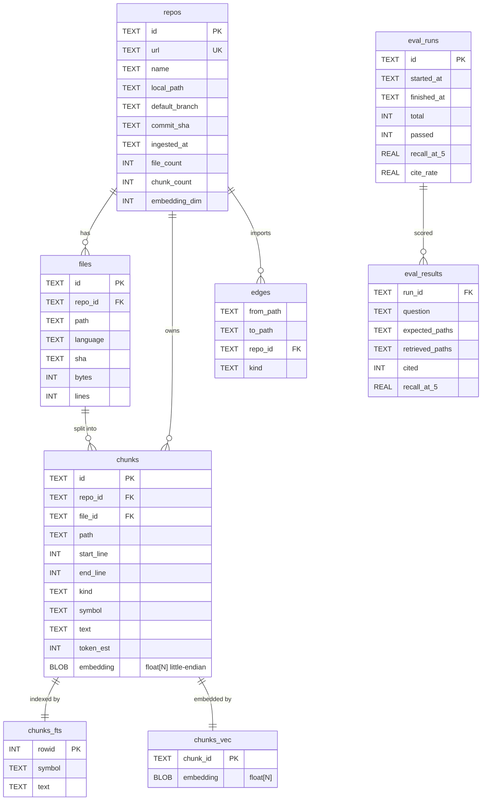
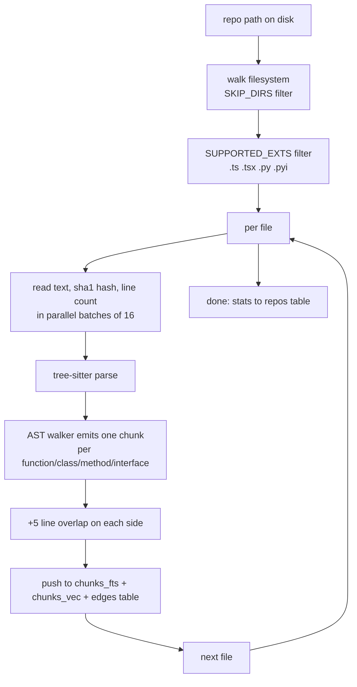

# Technical details

Deep-dive on the systems. The main README is for reviewers; this is for engineers who want to know how it works.

## Chunking

`lib/chunker/index.ts` dispatches by extension. `.ts`, `.tsx`, `.mts`, `.cts` go to `tree-sitter-ts.ts`. `.py`, `.pyi` go to `tree-sitter-py.ts`. Everything else falls through to a sliding-window fallback in `fallback.ts`.

### Tree-sitter TS chunker

Emits one chunk per `function_declaration`, `class_declaration`, `interface_declaration`, `type_alias_declaration`, `enum_declaration`, `method_definition`, `abstract_method_signature`, `function_signature`. We unwrap `export_statement` to get the inner declaration.

Each chunk gets 5 lines of overlap on each side. Small enough to avoid duplicating most code, large enough that a query spanning a function + the import above it still hits both.

**Known gap**: top-level arrow functions. `const foo = () => {}` requires detecting `assignment_expression` whose right side is `arrow_function`. 20-line patch; not in v1.

### Tree-sitter Python chunker

Emits one chunk per `function_definition`, `class_definition`, `decorated_definition` (unwraps the decorator).

### Sliding-window fallback

800-token target, 100-token overlap. Used for `.js`, `.jsx`, `.mjs`, anything tree-sitter can't parse. The fallback loses the AST-aware semantic boundary guarantee.

### Why tree-sitter

The alternatives for chunking code:

1. **LangChain `RecursiveCharacterTextSplitter`** — splits on `\n\n`, then `\n`, then ` `. Doesn't understand code. Same problem as sliding window: chunks cross function boundaries.
2. **LangChain `MarkdownTextSplitter`** — splits on markdown headers. Code isn't markdown.
3. **`split-by-function` regex** — looks for `def foo` or `function foo` patterns. Brittle on multi-line signatures, decorators, nested classes, arrow functions.
4. **LLM-based chunking** — costs money, adds latency, the LLM might disagree with itself across runs.
5. **LlamaIndex `CodeSplitter`** — closest competitor. Uses language-aware splitting but with simpler heuristics than tree-sitter. Worse on edge cases.

Tree-sitter is the industry default because it has grammars for 70+ languages, all maintained, all battle-tested. Used by GitHub, Neovim, every code editor with syntax highlighting. Not a one-off solution.

### Tree-sitter version pinning

We pin `tree-sitter@^0.22.4` and the matching grammar versions. `0.25.x` has a build regression on Node 25+ that the maintainers have not addressed. `0.22.4` ships prebuilt binaries for every platform under `prebuilds/`, loaded at runtime via `process.platform + process.arch` detection. The grammar version is decoupled from the runtime version, so we still get the latest TS/Python grammars.

If Node 26+ breaks 0.22.4's prebuilds, the fallback is `web-tree-sitter` (WASM). Slower to load (~3MB) but fully portable.

## Retrieval

`lib/search/hybrid.ts` runs BM25 and vector search in parallel and fuses them with Reciprocal Rank Fusion.

### Why hybrid

**BM25 (FTS5)** — keyword match. Catches exact identifier matches like `getUserById`, `authenticate`, `parseJWT`. Doesn't catch paraphrases — "how do users log in" returns nothing if the code says `authenticate()`.

**Vector (sqlite-vec)** — semantic match. Catches paraphrases. Doesn't catch exact identifier matches well — the embedding for "getUserById" is just a vector; a search for `getUserById` might miss it if the embedding is too generic.

**Both at once, fused with RRF** — catches both. RRF is parameter-free (no training), robust to score scale mismatch (BM25 is unbounded negative, vector similarity is [0,1]). What most production RAG ships.

### RRF formula

```
fused_score(d) = sum over i of 1 / (k0 + rank_i(d))
```

where `rank_i(d)` is the rank of document d in result list i (1-based). k0 = 60 (Cormack et al. 2009).

### FTS5 query sanitization

The original sanitizer ANDed every word in the question. A 6-word question like "What does the ingestRepo function do?" returned zero hits because no chunk had all six words. The fix:

1. Drop stopwords (the, a, what, how, does, do, is, are, ...).
2. Require tokens >= 3 chars.
3. Join with ` OR ` instead of space (which is implicit AND in FTS5).
4. Prefix wildcard on the last token.

```ts
const STOPWORDS = new Set(["the", "and", "for", "are", "but", "what", "how", "does", "do", "is", ...]);
function sanitize(q: string): string {
  const tokens = q.toLowerCase().replace(/[^\p{L}\p{N}\s_]/gu, " ")
    .split(/\s+/).filter(t => t.length >= 3 && !STOPWORDS.has(t));
  if (tokens.length === 0) return "";
  if (tokens.length === 1) return `"${tokens[0]}"*`;
  const last = tokens.pop()!;
  return [...tokens.map(t => `"${t}"`), `"${last}"*`].join(" OR ");
}
```

### sqlite-vec KNN quirks

Two non-obvious constraints:

1. **Literal `LIMIT`**. `LIMIT ?` (parameterized) fails with `SqliteError: A LIMIT or 'k = ?' constraint is required on vec0 knn queries.` Must interpolate the value directly. We bound `k` via the route's zod validation (`k: z.number().int().min(1).max(30)`) so SQL injection isn't a concern.

2. **JOIN with filter**. KNN only works on the vec0 table directly. To filter by joined columns, wrap the KNN in a subquery and filter in the JOIN:

```sql
SELECT ... FROM (
  SELECT chunk_id, distance FROM chunks_vec
  WHERE embedding MATCH ? ORDER BY distance LIMIT ?
) v
JOIN chunks c ON c.id = v.chunk_id
WHERE c.repo_id = ?
ORDER BY v.distance ASC LIMIT ?
```

### better-sqlite3 BLOB binding

Passing a JS array as a parameter spreads it across multiple args. Throws `RangeError: Too many parameter values were provided`. For BLOB columns, wrap arrays in `Buffer` via `packEmbedding()` (writes as little-endian float32):

```ts
export function packEmbedding(arr: number[]): Buffer {
  const buf = Buffer.alloc(arr.length * 4);
  for (let i = 0; i < arr.length; i++) buf.writeFloatLE(arr[i], i * 4);
  return buf;
}
```

## Prompt and citation format

System prompt (`lib/llm.ts`):

```
You are a code assistant for the repository "X".
Answer the user's question using ONLY the provided code excerpts.
Cite every claim with [src: <path>#L<start>-L<end>].
Use the path and line range of the chunk you are citing. Do not invent paths.
If the answer is not in the excerpts, say "I don't see that in the indexed code."
Be terse. Prefer code snippets to prose. No preamble, no closing pleasantries.
```

User prompt: each chunk formatted as `--- Chunk N ---\npath: ...\nlines: L<start>-L<end>\n```\n<code>\n```\n`. Then "Question: X\nAnswer with citations."

Citation tags are parsed client-side with the regex `/\[src:\s*([^\]]+)\]/g`. The path and line range are split on the last `#` so paths containing `#` still work. Click handlers open the local file at the line range.

## Guardrails

- The system prompt forbids invented paths. If a chunk does not actually contain the claim, the LLM cannot cite it.
- Temperature 0.1. Not zero (zero produces degenerate "I see the function `foo`" answers that loop). Low but not frozen.
- `max_tokens: 1200` on the LLM call. Bounds the cost per query.
- `MINIMAX_API_KEY` is required at boot. The app fails loudly if it is unset.

## Observability

Every LLM call writes one JSON line to stderr:

```json
{"ts":"2026-06-29T...","trace_id":"q-1234","kind":"llm","model":"MiniMax-Text-01","prompt_tokens":1820,"completion_tokens":340,"latency_ms":4200,"chunks_in":8}
```

Same for embeddings:

```json
{"ts":"2026-06-29T...","trace_id":"ingest-5678","kind":"embed","model":"embedding-2","prompt_tokens":9600,"completion_tokens":0,"latency_ms":1800,"n_inputs":32}
```

We pass `stream_options: { include_usage: true }` to the chat completion so prompt + completion tokens actually land in the log. Without that, OpenAI streaming doesn't emit usage and the log has `prompt_tokens: 0` for every call.

The UI also surfaces per-query latency end-to-end so a user can see whether a slow answer is the retrieval layer or the LLM.

## Eval

25 hand-written Q&A pairs in `eval/fixtures/`. For each: run hybridSearch, take top-5, compute `recall@5 = |retrieved_paths ∩ expected_paths| / |expected_paths|`. If `must_cite: true`, also call the LLM and check whether the answer contains a `[src: ...]` tag.

Results are persisted to `eval_runs` and `eval_results` tables. Trends are queryable from the DB; the UI shows the most recent run's per-question results.

### Why two fixture files

- `code-doc-assistant.eval.jsonl` (25 questions targeting `denoland/fresh`) — used after ingesting a fresh clone
- `code-doc-assistant-self.eval.jsonl` (25 questions targeting this project) — used after ingesting this repo

Pick the fixtures to match the ingested repo. Wrong fixtures = expected recall 0% by design.

## Data model (SQLite ER)



The `embedding` column is 1536 × 4 = 6144 bytes per row, packed as little-endian float32.

## Ingest pipeline



## MiniMax API quirks

**Chat completions**: OpenAI-compatible. The `openai` SDK works with `baseURL: https://api.minimax.io/v1`. Streaming, tool calls, all the standard fields.

**Embeddings**: NOT OpenAI-compatible. Different shape:

- Request: `{ model, texts: string[], type: "db" | "query" }` — NOT `input`. REQUIRES `type`.
- Response: `{ vectors: number[][], base_resp: { status_code, status_msg } }` — NOT `data: [{embedding}]`.
- Use raw `fetch()`, not the `openai` SDK.

Asymmetric retrieval: MiniMax recommends `type: "db"` for content being indexed, `type: "query"` for live retrieval queries. The model is tuned to recognize the difference.

Embedding models: `embedding-2` (1536-dim, the default), `embedding-3` (larger dim).

The MiniMax embeddings endpoint can rate-limit aggressively (status 1002 "rate limit exceeded(RPM)"). Chat completions are not affected. Production plan if it persists: swap to Voyage, Anthropic-via-Voyage, or local `bge-small-en-v1.5`.

## LLM resilience

- 30s timeout on the LLM call (OpenAI SDK `timeout` config)
- One retry on 429 / 5xx with 1s backoff
- `stream_options: { include_usage: true }` so usage tokens land in the log
- Eval harness catches LLM errors per-question and continues (doesn't fail the whole eval)

What's NOT yet implemented (future work):

- Circuit breaker (after N consecutive failures, fall back to Anthropic)
- Per-IP rate limiting on `/api/query`
- Caching of `(question_hash, repo_version)` → answer
